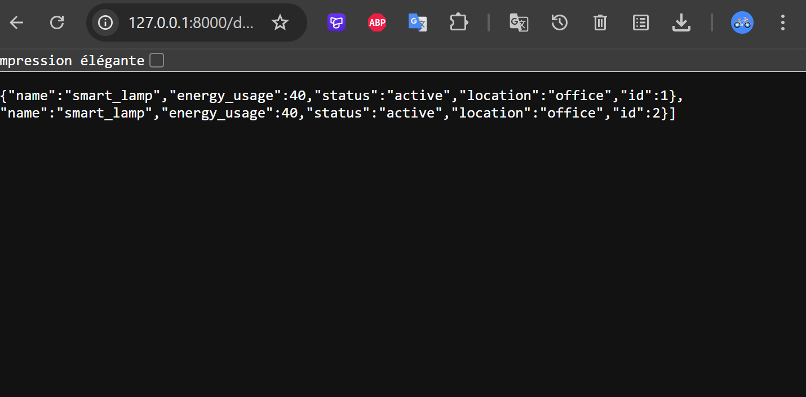
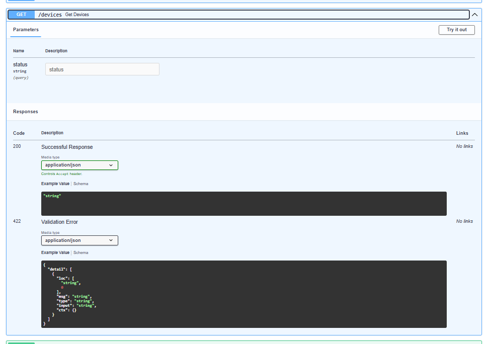
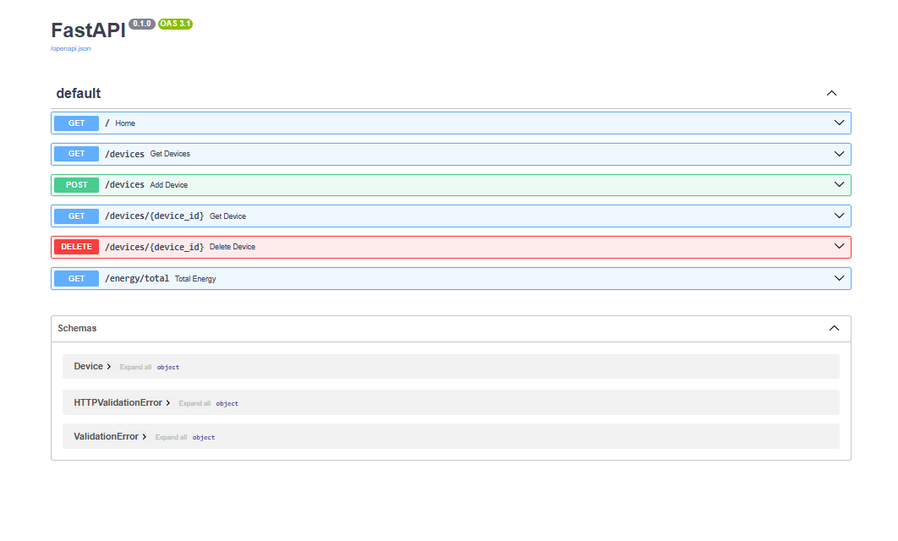

# Device Management API

## Project Description

This project is a REST API built using FastAPI.

It simulates a Smart Building system where devices such as lamps, refrigerators, and coffee machines can be managed.

The API allows:
- retrieving devices
- adding new devices
- deleting devices
- filtering devices
- calculating total energy consumption

## API Testing

The API was tested using the FastAPI interactive documentation available at:

http://127.0.0.1:8000/docs

All endpoints were tested:
- GET /devices
- POST /devices
- GET /devices/{id}
- DELETE /devices/{id}
- GET /devices?status=active
- GET /energy/total

## Screenshots

Add screenshots of:
- /docs interface
- POST request execution
- GET /devices response
- GET /energy/total response
## Screenshots

### API Documentation

### Add Device (POST)

### Get Devices

### Filter Devices

### Total Energy

